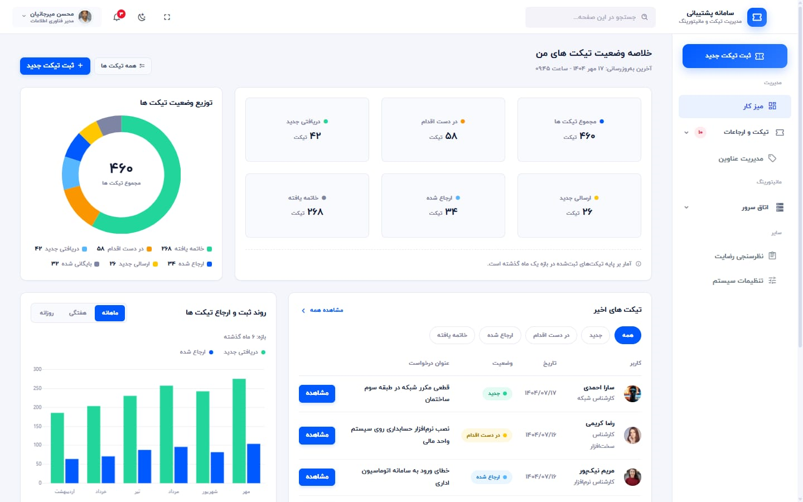
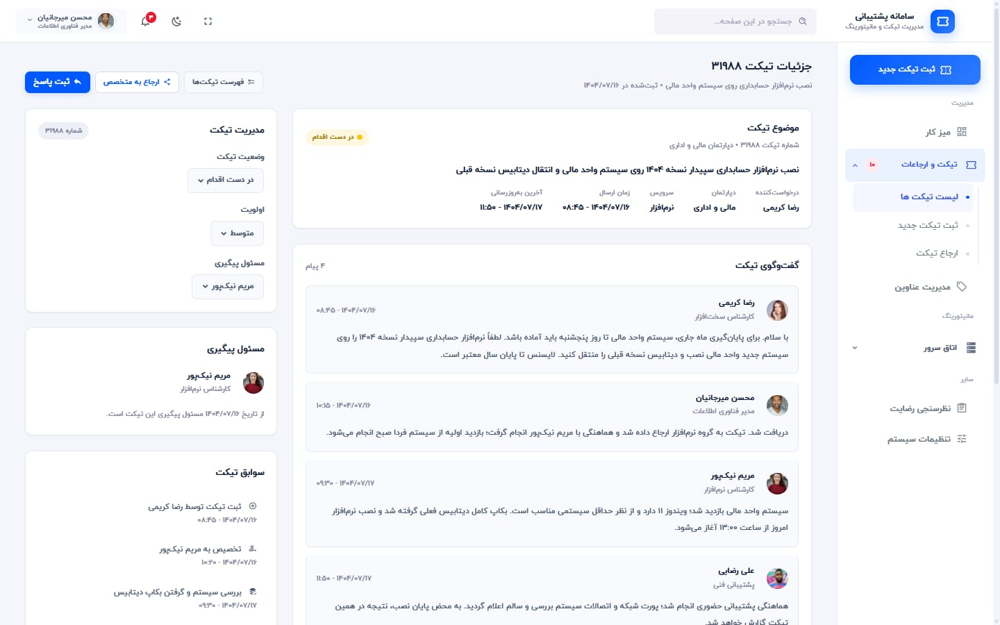
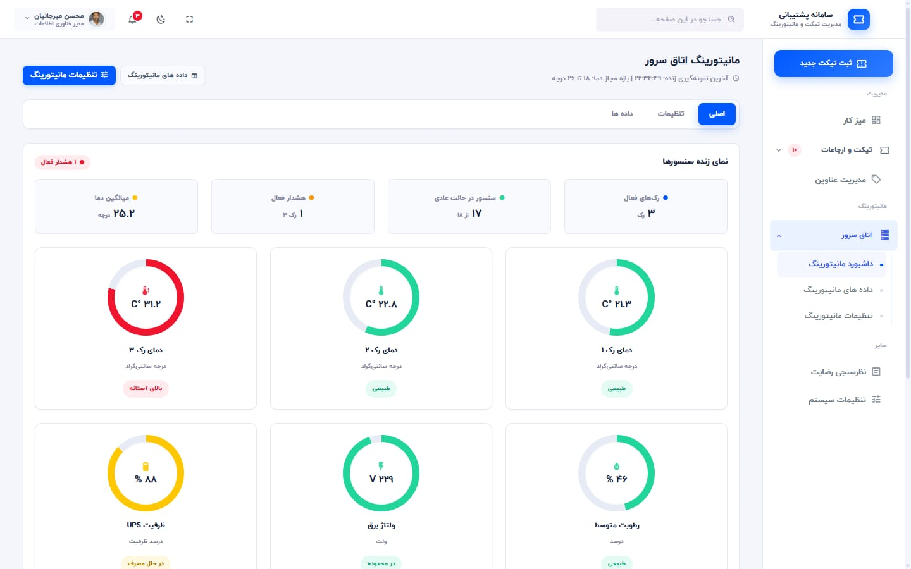
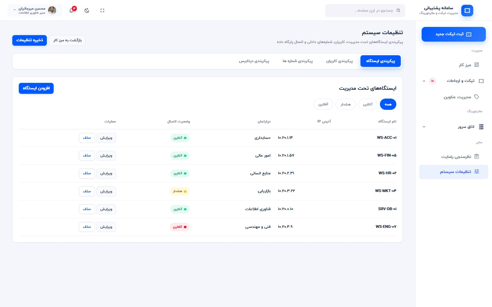
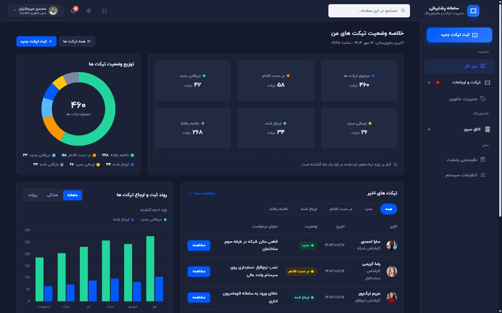
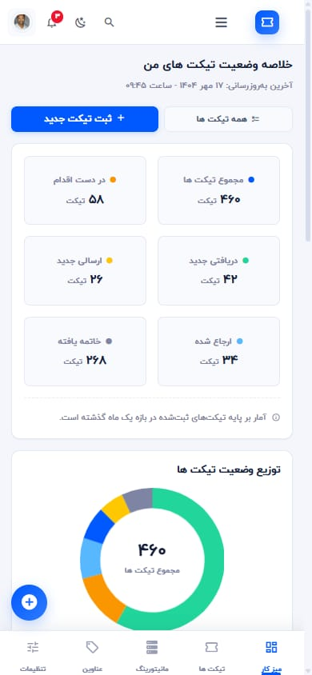

# 🎫 Support Dashboard

**Support Dashboard** – A complete, fully responsive RTL admin panel for **support ticket management and server-room monitoring**, built with **HTML, CSS and Vanilla JavaScript**.
Designed with **one shared design system, even spacing, smooth micro-interactions and full dark mode**, perfect for portfolio showcase.

> ⚡ **Portfolio-Level Project** – Showcasing Senior Front-End expertise in **RTL interfaces, dashboard layouts, data visualization and reusable component design**.

[](https://dashboard-2-puce.vercel.app/)

---

## 🛠 Tech Stack


---

## ✨ Key Features

- 📊 **Dashboard Overview** – Six KPI tiles, a ticket-status doughnut with a live centre total, a monthly stacked trend chart and the latest-tickets table
- 🎫 **Ticket Workspace** – Ticket header, requester card, conversation timeline with attachments and a quick-action side panel
- 🧾 **New Ticket Form** – Subject, category, priority, department and requester picker, frequent-requester chips, attachments and a rich description
- 🗂 **Subjects Library** – Searchable subject table with a category filter, row actions and pagination
- 🔀 **Referrals** – Referred tickets with status pills, knowledge-base draft cards and an observation-range selector
- 📝 **Satisfaction Survey** – Star rating, single and multi-choice questions, a free-text box and a live completion bar
- ⚙️ **System Settings** – Ticket options, SLA counters, notification switches and the department and allowed-IP tables
- 🖥 **Server Room Monitoring** – Live sensor gauges, a live clock, an alert log, a data-source switch and a circular observation-range dial
- 📈 **Monitoring Data** – Report range with export actions, a per-sensor history table and a bar/line chart
- 🎛 **Monitoring Settings** – Sensor thresholds, notification rules, sampling interval and the allow-list
- 🧱 **One Design System** – Every colour, radius, shadow and gap comes from design tokens in a single `theme.css`, so no page can drift away from the others
- 🌗 **Light & Dark Theme** – One click from the top bar, saved in `localStorage` and applied before the first paint
- 🇮🇷 **Persian First** – Full RTL layout, Persian digits and Jalali dates
- 📱 **Fully Responsive** – Off-canvas drawer, a bottom navigation bar and a floating action button that never sits on top of the content
- ⚡ **No Build Step** – Plain HTML, CSS and JavaScript with self-hosted fonts, icons and chart libraries

---

## 📸 Visual Preview

### 🏠 Dashboard

_Six KPI tiles, a live ticket-status doughnut, the monthly trend chart and the latest tickets._



---

### 🎫 Tickets

_Ticket header, requester card, conversation timeline and the quick-action side panel._



---

### 🖥 Server Room Monitoring

_Live sensor gauges, the live clock, the alert log and the observation-range dial._



---

### ⚙️ System Settings

_Ticket options, SLA counters, notification switches and the department and IP tables._



---

### 🌙 Dark Theme

_The whole panel in dark mode, switched from the top bar and remembered for next time._



---

### 📱 Mobile

_Off-canvas drawer, bottom navigation and stacked cards, down to a 390px viewport._



---

### 🔗 Live Demo

**https://dashboard-2-puce.vercel.app**

---

## 🗂 Pages

| Page | What it does |
| --- | --- |
| `index.html` | Dashboard overview – KPIs, ticket status chart and the latest tickets |
| `tickets.html` | Ticket workspace with the conversation timeline and quick actions |
| `ticket-new.html` | New ticket form with attachments and frequent-requester chips |
| `subjects.html` | Ticket subject library with search, filter and pagination |
| `referrals.html` | Referred tickets and knowledge-base drafts |
| `survey.html` | Support satisfaction survey |
| `settings.html` | System settings – ticket options, SLA, notifications and access lists |
| `monitoring.html` | Server room monitoring – live gauges, clock and alerts |
| `monitoring-data.html` | Monitoring reports and per-sensor history |
| `monitoring-settings.html` | Sensor thresholds, notification rules and sampling |

## 🧩 Project Structure

| Path | Description |
| --- | --- |
| `assets/css/theme.css` | The single design system – tokens, layout, components and responsive rules |
| `assets/js/dashboard-ui.js` | Theme, sidebar drawer, module tabs, table search and pagination |
| `assets/js/app.js` | Shell behaviour – preloader, dropdowns, fullscreen and active menu state |
| `assets/js/pages/` | Per-page behaviour – charts, monitoring gauges and live sensor values |
| `assets/css/*.css` | Bootstrap and the base panel styles the design system builds on |
| `assets/libs/` | Self-hosted vendor files – Chart.js, Font Awesome, SimpleBar and more |
| `assets/fonts/` | Icon webfonts |
| `assets/images/` | Logos, avatars and the README screenshots |
| `vercel.json` | Static hosting headers for the Vercel deployment |

---

## ⚙️ How It Works

1. Open the panel and read the KPI tiles and the ticket-status chart
2. Register a ticket from **ثبت تیکت جدید** in the sidebar or the floating action button
3. Set the subject, category, priority and department, then attach the evidence
4. Follow the answer in the ticket timeline and reply, or refer it to another department
5. Close the ticket and rate the support in the satisfaction survey
6. Watch the server room in the monitoring module – live gauges, alerts and historical reports

---

## 🚀 Setup

```bash
git clone https://github.com/condev-dev/dashboard-2.git
cd dashboard-2
open index.html
```

No install, no build, no dependencies. Just open it in a browser.

---

## 📄 License


**© ConDev** – All rights reserved.
